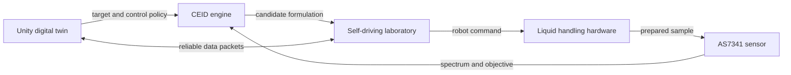

# Self-Driving Laboratory Digital Twin

This repository provides the reviewer-facing documentation, pseudocode, and experimental records for the AISCIA self-driving laboratory digital twin and its CEID-controlled colour-mixing study.

## Reviewer Start Here

- [Reviewer guide](REVIEWER_GUIDE.md)
- [Launch the WebGL digital twin](https://souhilsid.github.io/Self-Driving-Lab-Digital-Twin-/)
- [Manuscript author-note replacements](docs/paper/author-note-replacements.md)
- [Paper evidence and editable Word documents](docs/paper/README.md)
- [CEID and Unity pseudocode](docs/pseudocode/README.md)

## System Overview

The Unity digital twin provides target entry, experiment monitoring, manual and autonomous control modes, emergency-stop commands, and an immersive control interface. During autonomous operation, CEID proposes feasible colour formulations, the robotic self-driving laboratory executes each formulation, the AS7341 sensor measures the resulting spectrum, and the measured objective is returned to CEID for the next closed-loop decision.

LiveKit data packets are used for remote digital-twin transport. Credentials are supplied at runtime and are intentionally absent from this repository.

## Repository Scope

Included:

- Pseudocode-only descriptions of the CEID optimisation loop and the Unity digital-twin control loop.
- Sanitized 24-trial CEID closed-loop trace and target spectrum.
- Experimentally validated gravimetric raw readings, statistics, and figure.
- Manuscript-ready author-note replacements and editable Word documents.

Excluded:

- Proprietary CEID implementation source code and trained/internal optimisation components.
- Proprietary physical-hardware implementation details.
- Commercial Unity assets, large 3D models, and redistributable third-party packages.
- LiveKit API secrets, participant tokens, local environment files, and token bundles.

This package is intended for manuscript review and workflow inspection. It does not include implementation source code for CEID or Unity; only concise pseudocode and the supporting experimental records are provided.

## Licence and Access

The pseudocode and documentation in this repository are released under the [MIT License](LICENSE). The CEID engine, Unity implementation source, and hardware implementation are not publicly distributed. Requests for supervised CEID, digital-twin binary, or hardware access should be made through the corresponding author or AISCIA Informatics.

The reviewer WebGL build is deployed at https://souhilsid.github.io/Self-Driving-Lab-Digital-Twin-/. The Zenodo DOI and formal access contact will be added when available.
